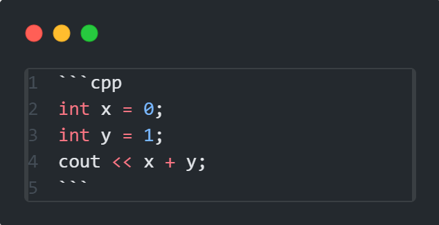

# Markdown Tutorial

This tutorial will help you understand the basics of writing in Markdown with examples.

## What is Markdown

> Markdown is a **lightweight markup language** that you can use to add formatting elements to plain text documents. Created by John Gruber in 2004, Markdown has become one of the world’s most popular markup languages.
> ([Markdown Guide](https://www.markdownguide.org/getting-started/))

**Markdown** can be used in various contexts to format text for the web. It is commonly used in **README** files, known for its simplicity and readability.

---

## How to

### Creating Headings

Use `#` symbols before your text to create headings. One `#` for `h1`, two `##` for `h2`, etc., with a space following the symbols.

**Examples:**
- ### This is an h3 heading created by writing `### This is an h3 heading created by ...`
- #### This is an h4 heading created by writing `#### This is an h4 heading created by ...`
- ##### This is an h5 heading created by writing `##### This is an h5 heading created by ...`

---

### Writing Normal and Plain Text

Simply type to add normal text without any special formatting.

---

### Formatting Text with Italic and Bold

- **bold**: write two asterisks before and after the word or sentence as `**bold**`.
- *italic*: write one asterisk before and after the word or sentence as `*italic*`.

---

### Making Lists

You can create both ordered and unordered lists.

1. **Unordered Lists**

    At the beginning of the line, use an asterisk (`*`), plus symbol (`+`), or hyphen (`-`).
    
    Example:
    
    ```markdown
    - list item
      - subitem
    ```

2. **Ordered Lists**

    Number each item.
    
    Example:
    
    ```markdown
    1. list item
    2. list item 2
      1. subitem
    ```

**Note:**

- Start a new line for each list item.
- Add a space after the list marker.

---

### Creating a Divider

Use three dashes `---`, three underscores `___`, or three asterisks `***` to create a divider like the one above.

---

### Writing Inline Code and Code Blocks

1. Inline code:
   Use single backticks ` `` ` around the code. For example, `This is inline code` and here’s how to write it: ``cout << "Hello World!";``

2. Code Blocks
   To write a code block, use three backticks ``` before and after the code snippet. To specify the language, write it next to the first set of three backticks.

   **Example:**

   

   **Output:**

   ```cpp
   int x = 0;
   int y = 1;
   cout << x + y;
   ```

---

### Creating Tables

I prefer using an online generator or a plugin like **Markdown Table Maker**. At all tables are created using vertical bars `|` and hyphens `-` for headings.

---

### Blockquotes

For blockquotes, simply add a `>` at the start of the line.

> Hi, I am a blockquote made by this:
> `> Hi, I am a blockquote made by this ...`

---

## Markdown Preview in VS Code

To view the output or result, press `Ctrl + Shift + V`, or click the **Open Preview** icon in the top right.

## Best Markdown Plugins in VS Code

- Markdown All in One - *By: Yu Zhang*
- Markdown PDF - *By: yzane*
- Learn Markdown - *By: Microsoft*
- Markdown Table Maker - *By: hellorusk*